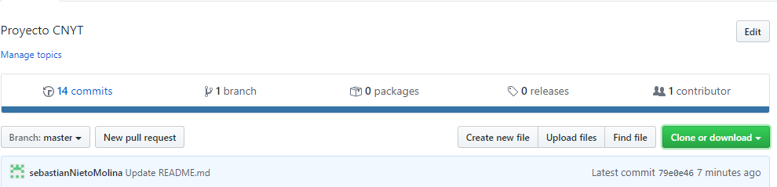
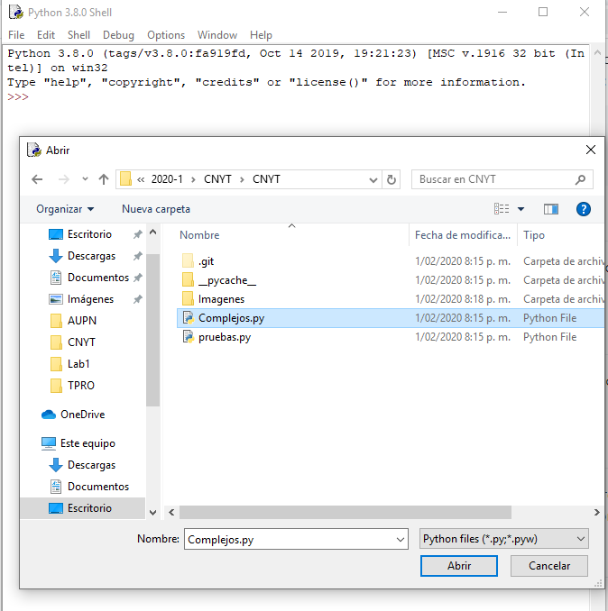
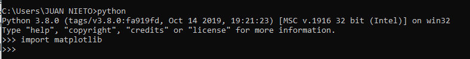
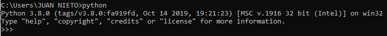
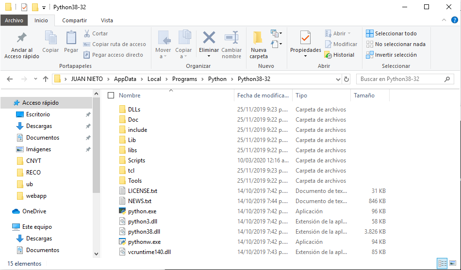

# Calculadora de complejos
El siguiente archivo cuenta con una libreria python que contiene funciones para operar numeros complejos.

## Operaciones que puede hacer

>- Sumar.
>- Restar.
>- Dividir.
>- Multiplicar.
>- Modulo.
>- Conjugado.
>- Pasar de coordenadas cartesianas a polares y viceviersa.
>- Fase.
>- Adición de vectores complejos.
>- Inversa de vectores complejos.
>- Multiplicación escalar de vectores complejos.
>- Adición de matrices complejos.
>- Inversa de matrices complejos.
>- Multiplicación escalar de matrices complejas.
>- Matriz transpuesta.
>- Matriz conjugada.
>- Matriz adjunta.
>- Función para calcular la "acción" de una matriz sobre un vector.
>- Norma de matrices.
>- Distancia entrematrices.
>- Revisar si es unitaria.
>- Revisar si es Hermitian.
>- Producto tensor.
>- sistemaDeterministicoProbabilistico
>- sistemaProbabilisticoMultiplesRendijas
>- simulacionCuanticaMultiplesRendijas

Estas operaciones cuentan con un archivo de pruebas que nos dan garantia de los resultados.

Para hacer uso de alguna funcion se debe tener en cuenta que todos los parametros entran como tuplas, en donde tenemos la parte real y la parte imaginaria separada; por ejemplo:

    a=(1,2)
    b=(3,4)
    sumar(a,b)

# Simulación de lo clásico a lo cuántico

En este módulo vamos a ver la transición de lo clásico a lo cuántico, empezaremos con los sistemas determinísticos, veremos que acá lo grafos no tienen peso. Después comprenderemos su funcionamiento con números reales, acá entenderemos como modelar un sistema probabilístico clásico y, por último, vemos su modelamiento con números complejos, que nos acercara al mundo de modelos cuánticos. Veremos su comportamiento con el experimento de la doble rendija. 

## Operaciones que se pueden hacer

>- sistemaDeterministicoProbabilistico
>- sistemaProbabilisticoMultiplesRendijas
>- simulacionCuanticaMultiplesRendijas

Cabe aclarar que la funcion simulacionCuanticaMultiplesRendijas, por defecto creara una grafica, por esa razon esta funcion no tiene pruebas.

## Pre-requisitos

Para hacer uso de esta libreria debemos tener instalado en nuestro computador una version de python 3. Si no tiene python puede descargarlos en este [link](https://www.python.org/downloads/).

## Instalacion

Para hacer uso de la libreria de numeros complejos, debemos descargar la siguiente [carpeta](https://github.com/sebastianNietoMolina/CNYT). y damos clic donde dice Clone or download.

Luego debemos ir a nuestro IDLE y abrir el documento como se muestra acontinuacion, para abrir la carpeta damos Ctrl+o, o vamos a File damos clic y luego en donde dice abrir.

Para hacer uso de matplotlib y poder ver graficas de barras debemos tener en cuenta lo siguiente.
>- Vamos a la consola de comando y escribimos python, luego intentamos importar matplotlib como se ve en la siguiente  si no sale ningun error por favor hacer caso omiso a los demas pasos, de lo contrario este tutorial te puede ser de ayuda.
>- Los siguientes pasos funcionan en python instalado en un sistema de Windows.
>- se debe verificar que al escribir python en la linea de comandos se debe ver algo similar como en la siguiente .
 >- Si sale un mensaje que diga quepython no se reconoce, probablemente tienes un problema de variables de entorno, te enseñare una forma para poder solucionarlo.
>-Si no conoces la ruta en donde quedo instalado python, debes colocar el siguiente comando en el cmd el siguiente comando: dir /s/b /A:D "C:python" en donde saldran una serie de rutas, por favor buscar cada ruta en el explorador de archivos y verificar que salga algo parecido a la siguiente 
>- Una vez verificado que es la ruta correcta nos dirigimos al panel de control, damos click sobre sistema y seguridad, luego sobre la opcion sistema y en la parte izquierda damos click sobre configuracion avanzada del sistema, se abrira una nueva pantalla, en ella buscamos la opcion variables de entorno, y en el recuadro inferior que se llama variables del sistema buscamos una que se llame Path y damos doble click sobre ella, se abrira una nueva pantalla, daremos click sobre la opcion nuevo, y copiaremos la ruta que habiamos encontrado con anterioridad, para salir damos aceptar para guardar las configuraciones echas. 
>- Ahora vamos al cmd e intentamos hacer la prueba que tenemos enunciado al principio del tutorial, a este paso ya deberia funcionar el comando python. Si por alguna razon importamos matplotlib y nos da un error es por que no la tenemos instalada, para ello debemos digitar los siguientes comandos.
    1. python -m pip install -U pip.
    2. python -m pip install -U matplotlib.
>- Luego de haber echo las instalaciones, intentamos hacer el primer paso del tutorial y no deberia haber ningun problema y estariamos listos para poder hacer nuestras graficas de barras.
    

## Pruebas

Para hacer uso de las pruebas, debemos ir a la carpeta que descargamos con anterioridad y abrir el documentos de pruebas.py desde nuestro IDLE. Estan pruebas tienen casos del libro y otros hechos por mi. Para ejecutar estas pruebas repetimos el proecdimiento anterio, pero ahora ya no escogemos Complejos.py si no pruebas.py.

